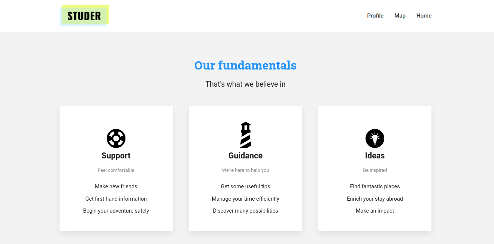
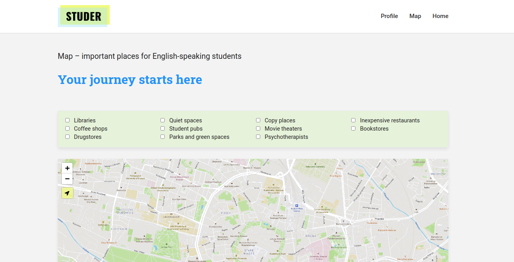
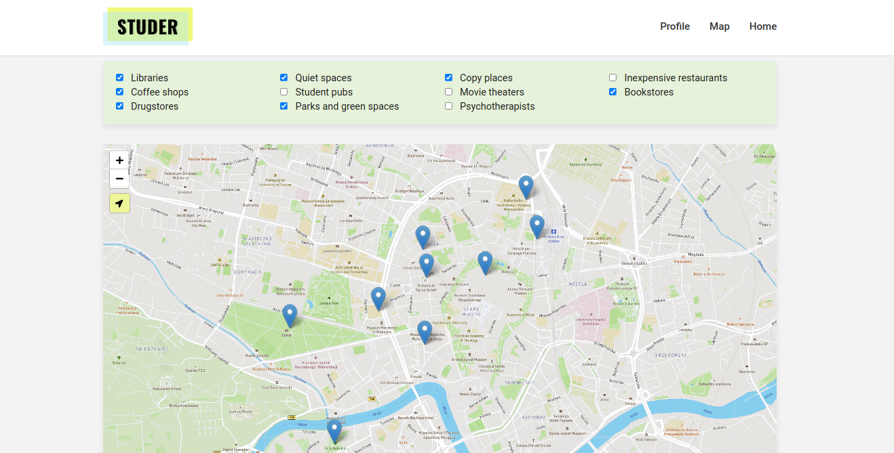
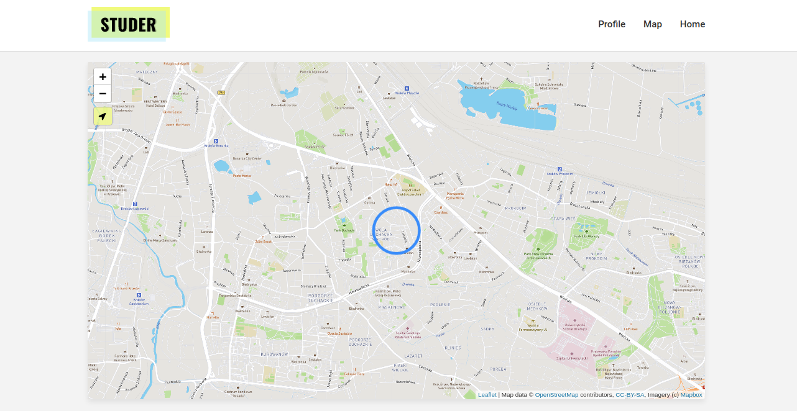

# Studer

## What is it?

The purpose of the application is to provide support to foreign students.

## Studer in action

The main part of our website is video with a girl.
 
We wanted to show her as the foreign student lost in the new habitat. 
Under the page header we set our application's assumptions.
 
It should support students, deliver a guidance and inspire.
As we go further we can see that girl is changing and finally meet her new friend.
##
Our first functionality is a map with places useful for foreign students.
 
We can choose many types of places that we want to be shown on the map.
 
Additionally, we came up with idea of showing user location. If we click on the green button, map will center on place
that we are in, and blue circle will suggest that we are in its range.
 
Of course, we can zoom in and out the map.
##
For now, we are finishing the functionality that we called 'Find a buddy', and starting a user profile section.

## Used technologies and tools

* Java 15
* React (Client part)
* Spring Boot
* PostgreSQL
* JSP
* Maven
* Docker

## How to run?

1. Download the repository to your machine. Download Client part as well that you can find 
   [there](https://github.com/emiliaszymanska/studerAppClient).
2. Open projects in your IDE. For Server part choose **userAndAdsRefactor** branch and for Client part - **profile** 
   (as we still work on this project).
3. In the Client part run command *npm install*.
4. In the Server part create an empty PostgreSQL database. In the *resources* folder you can find 
   the *app-properties-template* file. Fill in the missing data there and save it as 'application.properties'.
5. Fire up main method in the App class.
6. Fill in the database that you created with sample data from the *sql_data* folder. First *install_postgis*, then 
   *example_data_for_database*. (If you're using IntelliJ and you have connected a database to it, click right mouse
   button on database name, choose *Run SQL Script* and then choose mentioned files  from *sql_data* folder)
7. Launch 'npm start' in the Client part, and our app will open.
